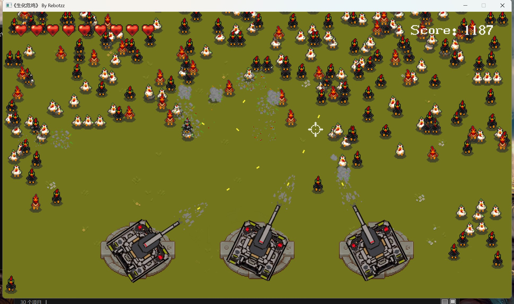

# 游戏：生化危鸡

## 简介
- 1.从easyX图形库过度到SDL库
- 2.脱离了windows API,所以窗口创建方式也变了
- 3.游戏开发完成


## 遇到的问题
```
1. 在没看voidmatrix教学视频之前，尝试实现了游戏，但是GPU占用过高，核显90%，独显50%；这里肯定有问题
Debug: 
在资源管理器导入的素材是SDL_Surface，所以每次引用素材都需要转为SDL_Texture，而这些可以在最开始处理
每一个动画的创建销毁都需要重新创建纹理，难怪占用高; SDL_Delay()忘记单位转化
解决：
1.资源管理器，图集，动画统一改用SDL_Texture
2.SDL_Delay()忘记单位转化ms

```

## 游戏截图

