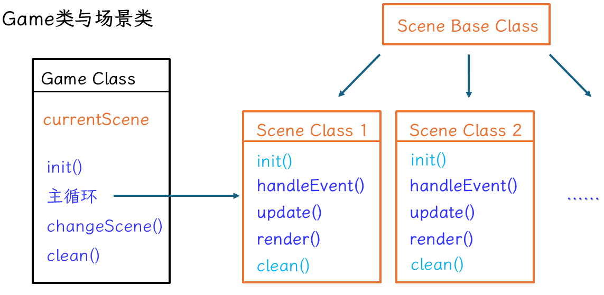
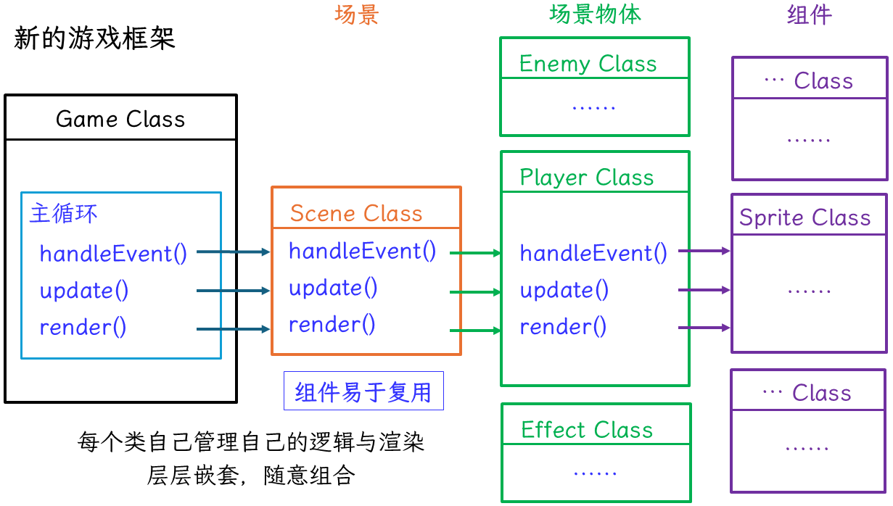
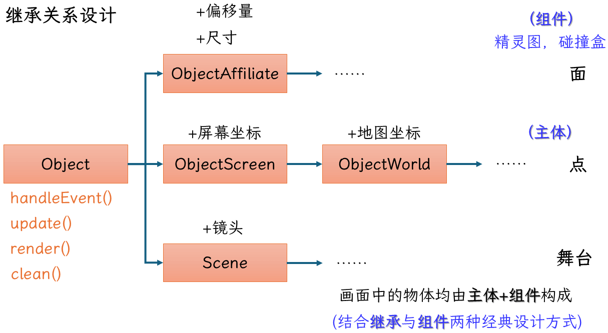
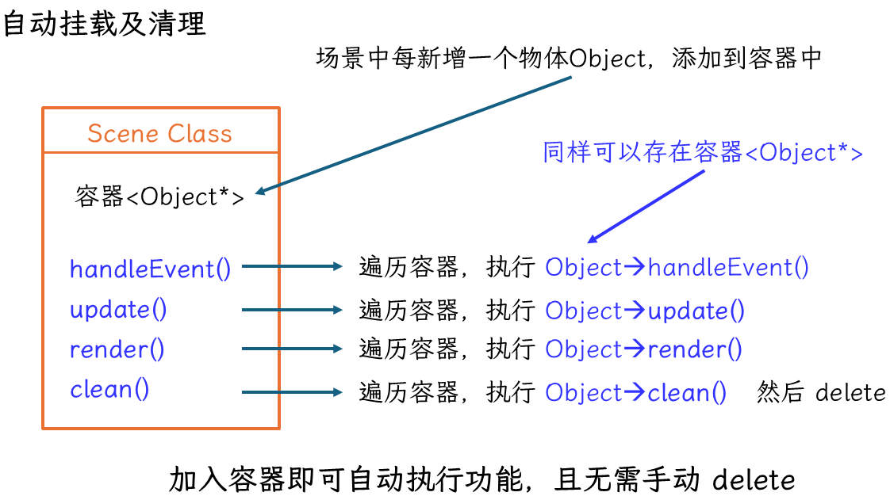
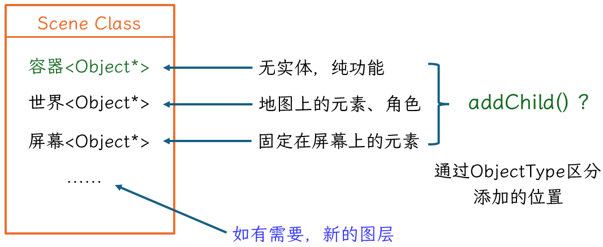
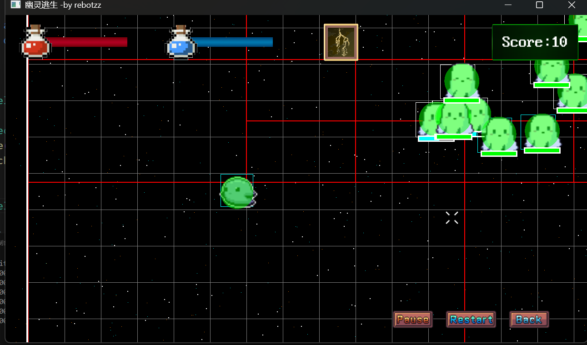

# 游戏：幽灵逃生

[参考教程](https://cppgamedev.top/courses/modular-ghost-escape)

## TODO
- [ ] 1. 加入技能，切换控制；玩家加入自动逃跑功能；
- [ ] 2. 资源管理器加入一个标记：使用ResID还是路径字符串；


## 简介

- **1. 使用`SDL3`和`glm`**
```
    教程地址:https://cppgamedev.top/courses/modular-ghost-escape/parts/part-01

    glm编译
    1.打开GLM官方仓库并下载源代码
    2.解压后用VS Code打开源码文件夹，并按照提示执行CMake配置。配置完毕后执行“生成”
    3.等待生成结束后，打开左侧资源管理器中的build文件夹，点开“cmake_install.cmake”文件，
    修改其中的 CMAKE_INSTALL_PREFIX 参数为你想要安装的位置。
    保存文件后打开“命令”面板（ctrl+shift+p），执行“Cmake 安装”

    SDL3_mixer编译

```
> **2. 新的代码框架**






> 游戏世界的基类Object
```cpp
// 所有游戏对象都继承自Object,实体/功能组件
class Object
{
protected:
    Game& game_ = Game::getInstance();
    std::vector<Object*> children_;         // 子节点：存放纯功能组件
    std::vector<Object*> children_to_add_;  // 待添加子节点，防止迭代器失效
    Object* parent_ = nullptr;              // 父节点
    bool is_active_ = true;                 // 是否启用
    ObjectType type_ = ObjectType::None;    // 类型
    bool can_remove_ = false;               // 是否需要移除,(标记后下次遍历前移除，避免delete this)

public:
    Object(Object* parent, ObjectType type = ObjectType::None);
    virtual ~Object();
    virtual bool handleEvent(const SDL_Event& event);
    virtual void update(float dt);
    virtual void render();
}

```

> 场景：承载实体和功能组件
继承链1：Object -> Scene -> 具体场景（标题、结束、战斗场景...）
无论是玩家、敌人、特效、法术、UI元素都由场景管理
```cpp
// 场景(纯功能)
class Scene : public Object
{
protected:
    glm::vec2 world_size_ = glm::vec2(0);           // 世界大小
    glm::vec2 camera_position_ = glm::vec2(0);      // 摄像位置
    std::vector<Object*> screen_children_;          // 区分不同渲染层级，屏幕物体
    std::vector<Object*> world_children_;           // 世界物体
    bool pause_time_ = false;                       // 时间暂停
    CollideMgr* collide_mgr_ = nullptr;             // 碰撞管理器

public:
    Scene();
    virtual ~Scene();

    virtual void init() {};
    virtual void clean() {};
    virtual bool handleEvent(const SDL_Event& event) override;
    virtual void update(float dt) override;
    virtual void render() override;

    // 工具函数
    virtual void addChild(Object* object) override;
    virtual void removeChild(Object* object) override;
    void cameraFollow(float dt, const glm::vec2& target);
    glm::vec2 worldToScreen(const glm::vec2& world_position) { return world_position - camera_position_; }
    glm::vec2 screenToWorld(const glm::vec2& screen_position) { return screen_position + camera_position_; }
    bool checkBeyoundScreen(const glm::vec2& world_position, const glm::vec2& size, const glm::vec2& margin = glm::vec2(30));

    // setters and getters
    const glm::vec2& getCameraPosition() const { return camera_position_; }
    void setCameraPosition(const glm::vec2& position);
    const glm::vec2& getWorldSize() const { return world_size_; }
    void setWorldSize(const glm::vec2& size) { world_size_ = size; }
    std::vector<Object*>& getWorldObjects() { return world_children_; }
    std::vector<Object*>& getScreenObjects() { return screen_children_; }
    void setPauseTime(bool flag) { pause_time_ = flag; }
    bool getIsPauseTime() const { return pause_time_; }
    CollideMgr* getCollideMgr() const { return collide_mgr_; }

protected:
    void updateCamera(float dt);
    void removeInvalidObject(); 
    virtual void renderStarsBackGround();
}

// 具体场景
class SceneMain : public Scene
{
protected:
    Player* player_ = nullptr;
    // ...

public:
    SceneMain();
    virtual ~SceneMain();

    virtual void init() override;
    virtual void clean() override;
    virtual bool handleEvent(const SDL_Event& event) override;
    virtual void update(float dt) override;
    virtual void render() override;

    // getters and setters
    Player* getPlayer() const { return player_; }
};
```


> 纯功能类：比如定时器、碰撞管理器、状态类
继承链1：Object -> CollideMgr 碰撞管理器
```cpp
// 碰撞管理器(纯功能组件)
class CollideMgr : public Object
{
private:
    std::vector<CollideBox*> colliders_;
    std::vector<CollideBox*> colliders_to_insert_;
public:
    CollideMgr(Object* parent):Object(parent){}
    ~CollideMgr() override;
    virtual void update(float dt) override;     // 检测碰撞
    virtual void render() override;             // Debug渲染
    
    // 工具函数
    void registerCollideBox(CollideBox* box);
    void detachCollideBox(CollideBox* box);
    void reinit();    // 构建当前场景的空间四叉树
    void clean();     // 清理
};
```


> 组件：游戏世界中的实体中包含它所需的组件（玩家类中有：动画、碰撞盒子）
继承链1：Object -> ObjectAffiliate -> Sprite -> SpriteAnim 图片/动画
继承链2：Object -> ObjectAffiliate -> CollideBox    碰撞盒子
```cpp
class ObjectAffiliate : public Object
{
protected:
    glm::vec2 size_ = glm::vec2(0);     // 尺寸
    glm::vec2 offset_ = glm::vec2(0);   // 偏移
    AchorMode achor_mode_ = AchorMode::CENTER;  // 锚点模式

public:
    ObjectAffiliate(Object* parent):Object(parent) {}

    // setters and getters
    virtual void setSize(const glm::vec2& size);
    const glm::vec2& getSize() const { return size_; }
    void setOffset(const glm::vec2& offset) { offset_ = offset; }
    const glm::vec2& getOffset() const { return offset_; }
    void setAchorMode(AchorMode mode);
    AchorMode getAchorMode() const { return achor_mode_; }
    void setAchorModeAndSize(AchorMode mode, const glm::vec2& size);
    void setRelativeOffset(const glm::vec2& relative_offset) { offset_ += relative_offset; }  // 现有偏移上累加
};

// 精灵图 (组件)
class Sprite : public ObjectAffiliate
{
protected:
    SDL_Texture* tex_ = nullptr;
    glm::vec2 tex_size_ = glm::vec2(0);
    glm::vec2 render_position_ = glm::vec2(0);  // 位置 = 父节点位置 + 偏移
    glm::vec2 render_percentage_ = glm::vec2(1.0f); // 图片绘制裁剪百分比，从左到右，从下到上
    float alpha_ = 1.0f;        // 透明度
    bool is_flip_ = false;      // 是否水平反转
    float angle_ = 0.0f;        // 旋转角度
    float is_showing_ = true;   // 是否渲染

public:
    static Sprite* createAndAddSpriteChild(ObjectScreen* parent, ResID tex_id, const glm::vec2 scale = glm::vec2(0.0f), 
        const glm::vec2& offset = glm::vec2(0.0f), AchorMode mode = AchorMode::CENTER);

    virtual void update(float) override;
    virtual void render() override;

    // setters and getters
    virtual void setSize(const glm::vec2& size) override;
    void setRenderPosition(const glm::vec2& position) { render_position_ = position; }  
    const glm::vec2& getRenderPosition() const { return render_position_; }
    void setRenderPercentage(const glm::vec2& percentage) { render_percentage_ = percentage; }
    void setTextureAlpha(float alpha) { alpha_ = alpha; }
    void setFlip(bool flag) { is_flip_ = flag; }
    void setAngle(float angle) { angle_ = angle; }
    void setShowing(bool flag) { is_showing_ = flag; }
    bool getShowing() const { return is_showing_; }
};

// 精灵图动画
class SpriteAnim : public Sprite
{
protected:
    int total_frame_count_ = 1;
    int frame_idx_ = 0;
    float frame_interval_ = 0.1f;
    bool is_loop_ = true;
    float timer_ = 0;   // 计时器

public:
    static SpriteAnim* createAndAddSpriteAnimChild(ObjectScreen* parent, ResID tex_id, int frame_count, float scale = 1.0, 
        float frame_interval = 0.1f, float is_loop = true, const glm::vec2 &relative_offset = glm::vec2(0), AchorMode mode = AchorMode::CENTER);

    virtual void update(float dt);
    virtual void render();

    // setters and getters
    float getFrameInterval() const { return frame_interval_; }
    void setFrameInterval(float interval) { frame_interval_ = interval; }
    void setLoop(bool flag) { is_loop_ = flag; }
    bool getIsFinished() const { return frame_idx_ >= total_frame_count_; }
    void setFrameIdx(int idx) { frame_idx_ = idx; }
    int getFrameIdx() const { return frame_idx_; }
    void syncFrameTime(SpriteAnim* sprite_anim);
    void restart() { frame_idx_ = 0; timer_ = 0; }
};

// 碰撞盒子(组件)
class CollideBox : public ObjectAffiliate
{
private:
    CollideShape shape_ = CollideShape::Circle;         // 碰撞外形。 如果碰撞外形为圆时,size_.x = size_.y = 直径
    glm::vec2 position_ = glm::vec2(0);                 // 位置。
    std::function<void(CollideBox *)> on_collide_;      // 碰撞发生时处理逻辑
    CollideLayer hit_layer = CollideLayer::None;
    CollideLayer hurt_layer = CollideLayer::None;

public:
    CollideBox(Object *parent, CollideShape shape, const glm::vec2 &size,
                const glm::vec2& offset = glm::vec2(0), AchorMode achor_mode = AchorMode::CENTER);

    virtual void update(float) override;
    virtual void render() override;
    
    // 工具函数
    bool checkCollision(CollideBox* target);
    void processCollide(CollideBox * target) { if(on_collide_) on_collide_(target); }

    // setters and getters
    void setCollideShape(CollideShape shape) { shape_ = shape; }
    CollideShape getCollideShape() const { return shape_; }
    void setPosition(const glm::vec2& position) { position_ = position; }
    const glm::vec2& getPosition() const { return position_; }
    void setOnCollideCallback(const std::function<void(CollideBox *)>& callback) { on_collide_ = callback; }
    void setHitLayer(CollideLayer type) { hit_layer = type; }
    CollideLayer getHitLayer() const { return hit_layer; }
    void setHurtLayer(CollideLayer type) { hurt_layer = type; }
    CollideLayer getHurtLayer() const { return hurt_layer; }
};
```

> 实体: 在屏幕/游戏世界中参与渲染、有自身执行逻辑。
继承链1：Object -> ObjectScreen -> ObjectWorld -> Actor -> Player/Enemy 具体玩家/敌人角色
继承链2：Object -> ObjectScreen -> ObjectWorld -> Spell -> 具体法术
继承链2：Object -> ObjectScreen -> HUD元素（文本框、玩家状态栏...）
```cpp
// 屏幕对象
class ObjectScreen : public Object
{
protected:
    glm::vec2 render_position_;
public:
    ObjectScreen(Object* parent):Object(parent, ObjectType::Screen) {}
    // getters and setters
    virtual void setRenderPosition(const glm::vec2& position) { render_position_ = position; }
    const glm::vec2& getRenderPosition() const { return render_position_; }
};


// 世界对象
class ObjectWorld : public ObjectScreen
{
protected:
    glm::vec2 world_position_;
    
public:
    ObjectWorld() { setObjectType(ObjectType::World); };
    virtual void update(float dt) override;
    // setters and getters
    const glm::vec2& getPosition() const { return world_position_; }
    virtual void setRenderPosition(const glm::vec2& position) override; // 同时修改渲染、世界坐标
    void setPosition(const glm::vec2& position);  
    void syncRenderPosition() { render_position_ = game_.getCurrentScene()->worldToScreen(world_position_); } 


}

// 角色
class Actor : public ObjectWorld
{
protected:
    glm::vec2 velocity_ = glm::vec2(0);
    float max_speed_ = 300.0f;
    Status* status_ = nullptr;  // 状态
    CollideBox* collide_box_ = nullptr; // 碰撞盒子

public:
    Actor(Object* parent):ObjectWorld(parent) {};
    virtual void takeDamage(float damage) { status_->takeDamage(damage); };

    // getters and setters
    float getMaxSpeed() const { return max_speed_; }
    void setMaxSpeed(float val) { max_speed_ = val; }
    Status* getStatus() const { return status_; }
    CollideBox* getCollideBox() const { return collide_box_; }
protected:
    virtual void move(float dt);
}

// 角色
class Player : public Actor
{
protected:
    SpriteAnim* anim_move_ = nullptr;           // 动画
    SpriteAnim* anim_idle_ = nullptr;
    WeaponThunder* weapon_thunder_ = nullptr;   // 武器
    Effect* effect_dead_ = nullptr;             // 特效
    Effect* effect_born_ = nullptr;

public:
    Player(Scene* parent, const glm::vec2& position);

    virtual bool handleEvent(const SDL_Event& event) override;
    virtual void update(float dt) override;
    virtual void render() override;

protected:
    // 工具函数
    void updateKeyboardControl();
    virtual void move(float dt) override;
    void updateSpriteAnim();
    void syncCamera(float dt);  // 相机跟随
};


class Enemy : public Actor
{
    enum class EnemyState
    {
        NORMAL, HURT, DEAD
    };
private:
    // 动画与状态
    SpriteAnim* anim_move_ = nullptr;
    SpriteAnim* anim_hurt_ = nullptr;
    SpriteAnim* anim_dead_ = nullptr;
    SpriteAnim* current_anim_ = nullptr;
    EnemyState current_state_ = EnemyState::NORMAL;
    // 目标玩家与武器
    Player* target_ = nullptr;
    Weapon* weapon_ = nullptr;

public:
    Enemy(Object *parent, const glm::vec2 &position);
    virtual void update(float dt);
    // setters and getters
    void setTarget(Player* target) { target_ = target; }
    Player* getTarget() const { return target_; }

protected:
    void updateVelocity();
    void updateState();
    void checkAndRemove();
    void attack();
};

```

- **3.世界坐标和屏幕坐标转化**
```cpp
glm::vec2 worldToScreen(const glm::vec2& world_position) { return world_position - camera_position_; }
glm::vec2 screenToWorld(const glm::vec2& screen_position) { return screen_position + camera_position_; }
```

- **4.游戏资源管理**
在原来得基础上修改了一下,直接生成头文件resID.h filename_to_resID.h
这样资源ID得初始化就更方便了一些。
修复了部分bug
```cpp
// 工具函数：创建资源名字与资源ID映射(即创建两个头文件resID.h filename_to_resID.h)
static void createFilenameResIDMap(const std::string& resources_dir);
```


- **5.武器类与法术类实现**
武器类可以通过回调生成法术，法术结束后自动销毁。
```cpp
// 父节点是角色(敌人/玩家): 改为继承附属对象，跟随玩家移动
class Weapon : public ObjectAffiliate   
{
protected:
    float damage_ = 10.0f;
    float attack_cd_ = 1.0f;
    float attack_timer_ = 0.0f;
    std::function<void()> attack_callback_; // 攻击执行逻辑
protected:
    virtual void update(float dt) override;
    virtual bool canAttack() const { return attack_timer_ >= attack_cd_; }
    virtual void attack(const glm::vec2& position);
}

// 法术类
// 父节点是具体场景：继承自世界对象，生成后属于场景组件，位置不变
class Spell : public ObjectWorld
{
protected:
    CollideBox* collide_box_ = nullptr;
    SpriteAnim* anim_ = nullptr;
    float damage_ = 20.0f;
public:
    virtual void update(float dt);
}
```

- **6.解决事件穿透，事件拦截处理**
```cpp
// 当世界处理了，就返回，如果没处理，那么继续向下传递
bool Scene::handleEvent(const SDL_Event& event)
{
    if(Object::handleEvent(event)) return true;

    // 优先处理屏幕事件，然后世界事件
    for(auto obj : screen_children_)
    {
        if(obj->getIsActive()) 
        {
            if(obj->handleEvent(event)) return true;
        }
    }

    if(!pause_time_)
    {
        for(auto obj : world_children_)
        {
            if(obj->getIsActive()) 
            {
                if(obj->handleEvent(event)) return true;
            }
        }
    }

    return false;
}
```

- **7.游戏内部鼠标绘制 + 屏幕缩放比列解决**
```cpp
class Game : public Singleton<Game>
{
    friend class Singleton<Game>;
private:
    // 窗口相关 
    glm::vec2 screen_size_ = glm::vec2(1280.0f, 720.0f);
    SDL_Renderer* renderer_ = nullptr;
    SDL_Window* window_ = nullptr;
    glm::vec2 window_scale_ = glm::vec2(1.0f);  // 当前窗口缩放比例
}

// Game初始化时设置逻辑分辨率
SDL_SetRenderLogicalPresentation(renderer_,  window_w, window_h, SDL_LOGICAL_PRESENTATION_LETTERBOX);

// 当窗口尺寸改变时更新比例
void Game::handleEvent()
{
    SDL_Event event;
    while(SDL_PollEvent(&event))
    {
        switch(event.type)
        {
            case SDL_EVENT_QUIT: is_running_ = false; break;
            case SDL_EVENT_WINDOW_RESIZED: updateWindowScale(); break;
            default: current_scene_->handleEvent(event); break;
        }
    }
}

// 更新当前窗口缩放比例
void Game::updateWindowScale()
{
    int window_w = 0, window_h = 0;
    SDL_GetWindowSize(window_, &window_w, &window_h);
    // 设置屏幕宽高比不变
    SDL_SetWindowAspectRatio(window_, screen_size_.x / screen_size_.y, screen_size_.x / screen_size_.y);
    // 如果是全屏那么宽高比会改变，所以也设置y轴缩放比例
    window_scale_.x = static_cast<float>(window_w) / screen_size_.x;    
    window_scale_.y = static_cast<float>(window_h) / screen_size_.y;
    SDL_SyncWindow(window_);
}

// 获取经过缩放映射后的鼠标位置。注意：不要直接SDL获取鼠标位置（没有经过缩放、会错位）
SDL_MouseButtonFlags Game::getMouseState(glm::vec2 &mouse_position)
{
    auto mouse_button = SDL_GetMouseState(&mouse_position.x, &mouse_position.y);
    mouse_position /= window_scale_;
    return mouse_button;
}
```
- **8.视差滚动星空背景**
1. 视差滚动（Parallax Scrolling）是一种模拟深度的视觉技术，通过让不同层次的背景以不同速度移动，创造出立体感和空间深度。这一技术最早应用于2D游戏，用来弥补2D游戏缺乏真实深度的不足。

2. 视差滚动的原理
视差滚动的基本原理来源于真实世界中的视差现象：
当我们移动时，近处的物体移动速度较快
远处的物体移动速度较慢
非常远的物体（如星空）几乎看不出移动
通过在游戏中模拟这种效果，我们可以在2D平面上创造出层次感和空间深度。

关键点在于每层星星的偏移量是相机位置乘以不同的缩放因子：
eg:
远处星星：相机位置 * 0.2（移动较慢）
中等距离星星：相机位置 * 0.5（移动速度适中）
近处星星：相机位置 * 0.7（移动较快）
这种差异化的移动速度正是实现视差效果的核心。
```cpp
// 渲染坐标 = 世界坐标 - 相机位置 * 系数
auto render_pos = stars_position[i] - camera_position_ * distance_scale[idx];
game_.renderFillRect(render_pos, glm::vec2(1), color[idx]);

// 或者
game_.drawPoints(star_far_, - game_.getCurrentScene()->getCameraPosition() * scale_far_, color_far_);
game_.drawPoints(star_mid_, - game_.getCurrentScene()->getCameraPosition() * scale_mid_, color_mid_);
game_.drawPoints(star_near_, - game_.getCurrentScene()->getCameraPosition() * scale_near_, color_near_);
```


- **6.使用`空间四叉树`优化碰撞检测**
尝试写了一个四叉树，但是我找到的教程都没有关于碰撞盒子位置动态更新的部分。
这里用了两种方法：
1.每次更新前销毁旧的四叉树，重构新的（缺点：性能消耗大）
2.松散四叉树边界检测，动态调整小于阈值的节点
```
// TODO: 还有bug，引用计数不正确、超出世界无法插入直接移除等……不过，代码能跑了。
// BUG: 因为插入失败等原因，可能导致应该碰撞，但是不发生碰撞的情况。
// 每次清理重构可以减缓这个bug，而动态更新会导致这个bug更明显
```


## TODO
1. 场景只绘制屏幕范围元素
2. 修复空间四叉树(还有Bug) 
3. 特效类优化，提高泛用性，一如敌人生成特效。
4. spell优化，提高泛用性。
5. 有了碰撞可以实现反弹、推动等物理效果。
6. 检查是否内存泄漏


## Debug
```
    1.cmake添加源文件
    file(GLOB_RECURSE my_sources src/*.cpp)

    2.为了方便，我把三方库放在文件路径下，没有添加环境变量，
    所以，在可执行文件路径下需要放置库文件.dll(windows环境)

    3. 野指针/迭代器失效: 
    delete this，如果在类中delete this之后还有执行内容，会野指针。解决：改用标记setCanRemove，下次遍历初delete  
    遍历途中插入新的元素,vector可能扩容释放旧空间。解决：放入临时容器，下次遍历初push    safeAddChild
    场景切换导致资源清理问题， 放入临时变量，下次遍历初change    safeChangeScene

    4.智能指针使用问题：
    shared_ptr只管理拷贝于自生的，新建的智能指针是一个单独的个体，
    与原来的没有关联，虽然指向同一对象地址，但销毁时都会调用析构
    这会导致delete两次报错。将智能指针放在容器里，如vector,定位new，复制重载，析构。容器处理了这些。

    5.哈希map使用[]的问题
    如果没有在hash表中就会插入，有的话返回引用。
    需要注意使用的前提条件。还有考虑到[]覆盖原有值得问题。
```


## 吐槽
```
version0.1完成,俺寻思这样写可以
总算写完了，
虽然代码采用自动挂载、自动处理的架构方便不少。
但也意味着和我之前习惯的写法有些不同，之前我习惯东西都放一起。
只有handleEvent, update, render
而现在，我需要考虑怎么把东西拆分为主体+组件。
理解和习惯这种模式花费了一些时间。虽然代码量增长不多，但是比上一个SDL_Shooter难写多了。
当我看完一遍教程后，有种感觉忘记的差不多了……(￣_￣|||)
然后呢，自己借着部分印象 + 俺寻思可以这样写 = 最终的成果有点地方可能和原教程差距较大。
接下来，该看看原教程代码和自己的区别。  
对照完成，我都忘了原教程原来博客这么长，好用心。

version0.2完成,增加敌人行为模式，加入空间四叉树(有bug，但能运行)
debug了好久，就像没头苍蝇一样. 
一些问题随着时间与经验的积累会解决。

```

## 游戏截图



## Debug-History

武器类（fixed: bug！） 
场景切换: 标题场景	画面比例缩放问题。	摄像机位置限制bug.

解决事件穿透，事件拦截处理； 事件处理的优先级。--- 怎么决定？ 在容器中的先后顺序； 
不，更合理的是用不同容器分隔，纯粹功能容器 > 屏幕对象容器 > 世界对象容器
星空背景 + 背景纵深
游戏内部鼠标绘制 + 屏幕缩放比列解决

一段时间后，没有元素的网格回收，元素过少的网格合并。
目前四叉树没有加入碰撞盒子移动改变功能。 等待加入。
智能指针 + vector： 所以vector开辟空间后，使用定位new初始化，结束时调用析构
碰撞盒子持有对方引用，需要观察者？
栈溢出。 erase 部分是否清理vector
碰撞管理器安全插入问题：下一次更新再插入		确实是这个问题！
新的问题： 敌人画面抖动
碰撞盒子更新频率。或许需要改为碰撞盒子出入边界。而不是彻底重构

因为没有调用碰撞盒子的更新（遍历列表更新位置等），
只有处理碰撞时更新了。还有或许重构四叉树代价太大，帧间隔过大以至于画面抖动
**智能指针使用问题**：
shared_ptr只管理拷贝于自生的，新建的智能指针是一个单独的个体，
与原来的没有关联，虽然指向同一对象地址：这会导致delete两次报错。


还是存在野指针问题。。。
难道需要safeErase???
错误原因： 重复delete两次。
而且引用计数竟然出现了负数。我改了一下，如果出现负数，就不delete。
暂时没有报错了，但是为什么？
刚创建时是0，应该还是re insert重新分配的问题。
不，我发现所有引用计数出现负数的都是法术。看来法术休要修改。是吗？不能确定。
角色莫名其妙扣血，可能原因。子弹没有销毁。看不见的子弹还在伤害玩家。
那么有可能内存泄漏 已修改。子弹失效后没setCanRemove()
还是有问题，我决定暂时搁浅。保留碰撞管理器。
但改用双重for检测碰撞
！
需要观察者。一直以来，并不同步。
碰撞管理器删了，但是没有同步给CollideBoxWrapper
不，现在这个碰撞管理器设计与原有设计不太接轨。
关于碰撞盒子的生命周期管理问题没有处理好。
现在恢复原有设计：**由碰撞主体持有碰撞盒子，并且管理碰撞盒子**。
**而碰撞管理器只是持有指针**，当碰撞主体销毁（连带它的组件-碰撞盒子）时，通过观察者模式给碰撞管理器发送消息，删除指针。

有没有可能在QuadTree更新过程中出现取消碰撞盒子注册？有可能！
碰撞回调中可能。但是回调中一般设置的是设置标记位。
不，也不是这个问题。这个之前处理过了。

**新的发现：哈希map使用[]的问题。没有的元素会插入。**
之前使用[]的前提是默认hash表中一定有，而且没有在hash表中就不会存在四叉树中。
看来，四叉树中还残留有，没有删除干净。
检测后再使用[]代码没有报错。能运行了，
引用计数还有问题，虽然引用计数在这里是为了防止野指针，不要也能运行。

