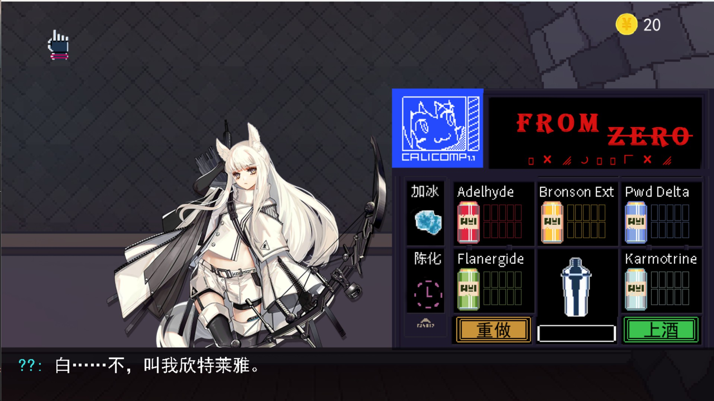
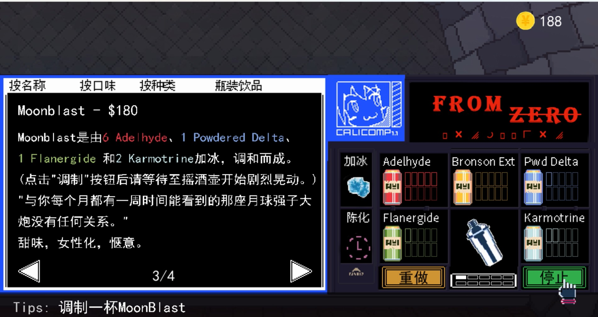
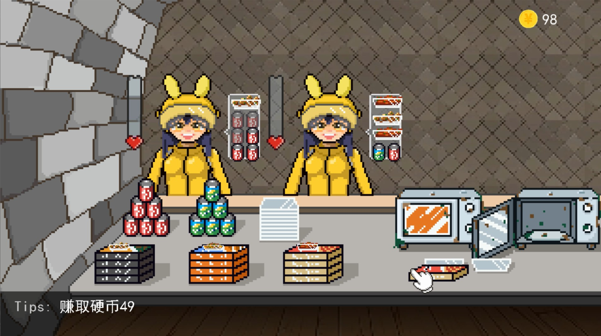

# 游戏：拼好饭与调酒

## 简介
- 1.使用了SDL库，C++17 filesystem文件迭代器使用。
- 2.一开始复现了鼠标点击拖拽交付物品逻辑，后来觉得太单调，加入调酒系统，再然后加入了对话系统。
- 3.拖拽交付主要由鼠标管理器 + 可拖拽道具枚举ID实现。
- 4.调酒配方检验由trie树实现，调酒材料，就像单词前缀的题目
- 5.实现了一个简单的对话系统，模仿《赛博朋克：酒保行动》的对话脚本，简化了格式。
- 6.游戏由对话脚本驱动，所以游戏解析对话脚本，确定执行任务（对话模式、游戏操作模式），任务完成再解析新的指令。
- 7.加入对话后，更像一个游戏了。一场对话的开始，一段故事上演……


## 遇到的问题
```
手动设置区域太麻烦了，而且很低效。
代码编写时没有明确框架，写一点想一点，就像摸着石头过河。
```

## 游戏截图


