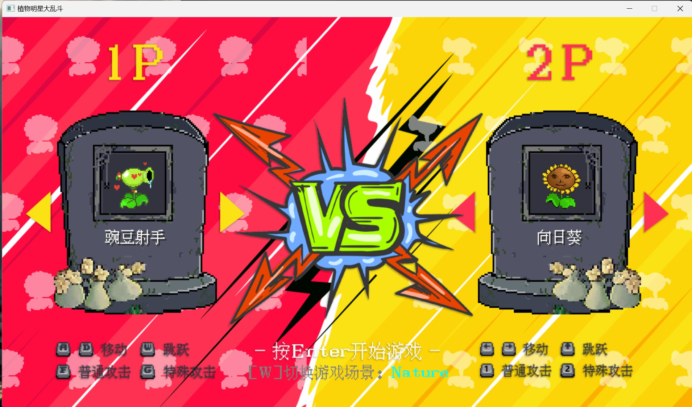

# myproject
项目练习代码

## http server 自主实现http服务端
[项目地址](https://github.com/rebotzz/myproject/tree/main/httpserver)

###  使用知识
- 1.tcp通讯,linux网络接口的使用
- 2.http协议,读取并解析报头,构建响应,发送数据
- 3.线程池技术,生产者消费者模型,互斥锁和条件变量
- 4.单例设计, CGI原理:进程替换,进程间通讯/传参:匿名管道,环境变量
- 5.实现http/1.1长链接功能:单独一个线程管理连接,超时处理
- 6.cgi功能:留言板,网络计算器,mysql数据库访问(注册)

### 效果展示

## 燃气轮机特性线外插程序
[项目地址](https://github.com/rebotzz/myproject/tree/main/turbExtra)

###  使用知识
- 1.数学部分: 相似理论,插值
- 2.神经网络:使用python训练神经网络(非线性回归),并在C++代码中使用模型
- 3.可视化:制作了可视化界面,数据的绘制图像
- 4.使用的三方库: easyX绘图, xlnt使用excel数据, boost插值, imgui制作图形界面, libtorch调用神经网络模型, 使用了python处理数据,训练模型

### 效果展示

## 植物明星大乱斗小游戏
[项目地址](https://github.com/rebotzz/myproject/tree/main/plant_star_battle)

## 使用知识
- 1.使用easyX图形库和windows API实现游戏功能
- 2.数据逻辑和渲染分离,程序的主框架(初始化->循环[消息处理->数据处理->渲染处理])
- 3.场景管理器, 定时器, 摄像机, 动画类
- 4.粒子系统, 碰撞检测,物理模拟简易实现

### 效果展示

### 其他项目
- 1.提瓦特幸存者小游戏