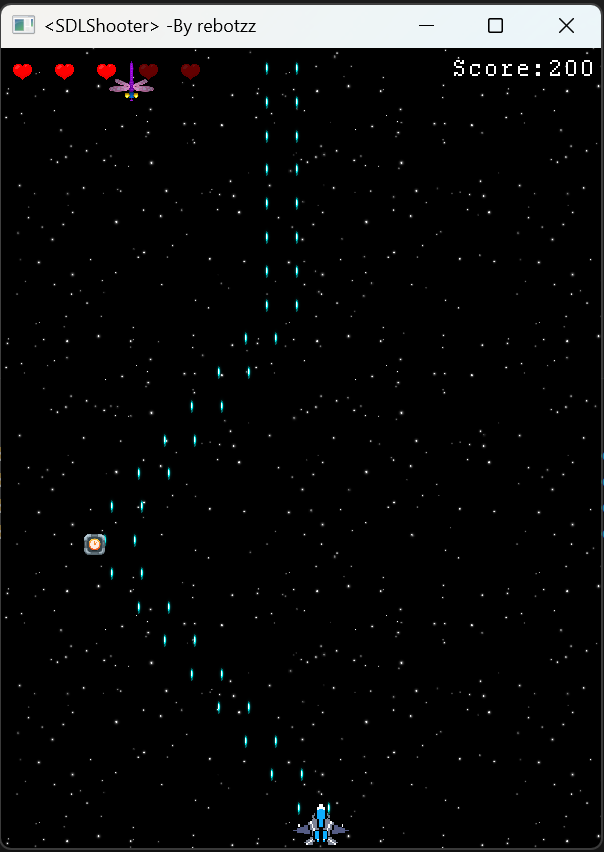

# 游戏:SDL2与太空战机

## 简介
- 1.改用`vscode`/`g++`/`make`编译代码,这次不用`visual stuio`
```
    在window下使用vscode,make,g++编译程序,还真是新奇的体验。
    不过make执行指令不能是linux指令,它创建子进程和进程替换也不是用fork.
    好久没有手写makefile了,算是复习。那么调试时也可以复习gdb
    visual stuio平时把这些命令行指令统一成了图形界面，那么vs能用命令行
    例如：msbuild MyProject.sln /p:Configuration=Release

    使用cmake生成中间多了很多步骤，报错也不好找。
    相对而言，使用make能更好的查看报错。还是make更熟悉。
```

- 2.`cmake`使用
```
    cmake在vs和make/g++之上，之后可以配置试试cmake;
    cmake尝试之后，确实不错，编写CmakeLists.txt比makefile简单一些
    使用的话：
    1.在代码目录下创建编写CmakeLists.txt  (注意:新加入.c/.cpp源文件后记得add_executable加上)
    2.创建build文件夹，用于存放中间文件，例如使用visual stuio生成的.sln;g++生成的makefile等
    3.在build目录下运行cmake (参数:指定路径有CmakeLists.txt的路径),生成中间文件(sln或者makefile...) 
    (
        这里可以选择生成工具包(visual stuio 或者 g++; 选项),如果使用vscode这里就很方便了,可以在输出看设定的选项
        [cmake选项] 
        Release/Debug模式: cmake -DCMAKE_BUILD_TYPE=Release
        选择编译器: -DCMAKE_CXX_COMPILER=/usr/local/gcc/bin/g++
        指定生成器: -G "Visual Studio" 或者 -G "MinGW Makefiles"
        一些字段也可以在CmakeLists.txt中设置：
        set (CMAKE_C_COMPILER "/usr/local/gcc/bin/gcc")
        set (CMAKE_CXX_COMPILER "/usr/local/gcc/bin/g++")

    )
    4.然后在build目录运行cmake --build . 别忘了".",即build路径,通过中间文件(sln...)生成可执行文件
    还待进阶学习...
    比如CMakePresets.json
```

- 3.资源加载 `单例` `代理模式`
```cpp
    老套路，使用资源管理器，需要注意素材名字统一风格(别出现字母/数字/下划线之外的,这样不好建立ResID变量名),
    powertoys的重命名挺好用，还是递归的。
    使用文件夹区分素材比单纯命名方便多了。对了，不同字体使用"代理模式"。
    "filesystem递归 + 仿函数不同类型文件分类处理" 方便多了。

    单例: 这种写法方便多了
    static T& getInstance()
    {
        // c++11 饿汉模式,线程安全
        static T instance;
        return instance;
    }
```

- 4.玩家临时Buff实现 `装饰者模式`
```cpp
    Buff通过装饰模式实现。装饰模式 --> 核心："层层调用"
    version 1.0
    一开始我只打算添加"包装",不解除,知道最后玩家死亡才删除,这是层层析构。
    virtual析构函数的作用终于体现出来了。
    version 2.0
    后来觉得这个太臃肿，而且Buff一般有时间限制。
    所以通过检测是否失效，获取内部装饰的对象指针，delete外层失效包装器。这样就实现了预期效果。
    最开始解除装饰者模式模式时就感觉很臃肿,外包装只做很少一部分工作，却拥有核心全部字段，而且用不到。
    然后就是需要大量虚函数，即使只是get/set字段,而且别的包装器也要实现。
    不过，通过空间/效率换取相对简单的实现，有利有弊吧。

    // 具体实现
    ShieldPlayer::~ShieldPlayer()
    {
        SDL_Log("~ShieldPlayer()");
        // v1.0不单独去掉包装,整体销毁,一层一层调用析构
        // delete player;      
        // v2.0由外层判断包装是否失效,单独去掉包装
    }
    // 失效检测:每一层内部都要执行,然后最外层的持有者也要执行(即SceneMain::update()),注意最内层player永不失效
    void ShieldPlayer::update(double deltaTime)
    {
        player->update(deltaTime);
        duration -= deltaTime;
        // 装饰者失效检测
        if(duration < 0) wrapper_valid = false;
        while(!player->get_wrapper_valid())
        {
            auto internal_player = player->get_interal_player();
            delete player;
            player = internal_player;
        }
    }
    // 资源释放(最外层持有者SceneMain::exit()):包装器层层析构  
    while(player)
    {
        auto internal_player = player->get_interal_player();
        delete player;
        player = internal_player;
    }

    // 关于子弹生成实现:
    // 问题：子弹生成被player->update()调用,不方便直接修改。
    // 最开始的想法使用仿函数，咋看还行，但是有"野指针"问题。
    // [this]捕获的this是当前层包装器，却直接击穿到最底层。
    // 那么当外层包装器失效时，函数对象内部保留的this指针就变成野指针。
    player->set_spawn_bullet_callback([this]
    {
        Bullet* bullet_left = new Bullet(bullet_template);
        Bullet* bullet_right = new Bullet(bullet_template);
        bullet_left->pos = player->get_pos() - Vector2(static_cast<double>(player->get_width()) * 0.25, 0.0);
        bullet_right->pos = player->get_pos() + Vector2(static_cast<double>(player->get_width()) * 0.25, 0.0);
        Mix_PlayChannel(-1, ResMgr::getInstance().find_sound(ResID::Sound_XsLaser), 0);
        player->get_bullets().push_back(bullet_left);
        player->get_bullets().push_back(bullet_right);
    });
    // 解决：内层不能依赖外层数据，所以改为函数形参,即用即失效。
    typedef std::function<void(std::vector<Bullet*>&, const Vector2& player_pos, 
        int player_w, int player_h, const Bullet& bullet_template)> SpawnBulletCallback;
    player->set_spawn_bullet_callback(
        [](std::vector<Bullet*>& bullets, const Vector2& player_pos, int player_w, int player_h, const Bullet& bullet_template)
        {
            // this会失效,而this会传递给内层包装器,所以最好别用到[this]
            Bullet* bullet_left = new Bullet(bullet_template);
            Bullet* bullet_right = new Bullet(bullet_template);
            bullet_left->pos = player_pos - Vector2(static_cast<double>(player_w) * 0.25, 0.0);
            bullet_right->pos = player_pos + Vector2(static_cast<double>(player_w) * 0.25, 0.0);
            Mix_PlayChannel(-1, ResMgr::getInstance().find_sound(ResID::Sound_XsLaser), 0);
            bullets.push_back(bullet_left);
            bullets.push_back(bullet_right);
        });

    // 感觉还是有些小bug,或许是错觉...?
```

- 4.`SDL2`使用
```cpp
    SDL_Volume  音量调节
    SDL_GetKeyboardState 按键状态, 获取数组,配合SDL_SCANCODE使用
    auto key_array = SDL_GetKeyboardState(nullptr);
    direction = {static_cast<double>(key_array[SDL_SCANCODE_D] - key_array[SDL_SCANCODE_A]),
    static_cast<double>(key_array[SDL_SCANCODE_S] - key_array[SDL_SCANCODE_W])};

    文本输入: 回车键算SDL_KEYDOWN
    SDL_IsTextInputActive   
    SDL_StartTextInput
    SDL_StopInputActive

    // 设置逻辑分辨率，用于全屏缩放
    SDL_RenderSetLogicalSize(renderer, window_w, window_h);
```

- 5.中文退格处理
```cpp
    // 处理中文退格
    // Ascii一个字节,第一个bit位是0
    // 中文,多个字节,第一个字节以多个1开头,后跟一个0,后续字节都以10开头
    if((name.back() & 0b10000000) == 0b10000000)
    {
        name.pop_back();
        while(!name.empty() && (name.back() & 0b11000000) != 0b11000000)
        {
            name.pop_back();
        }
    }
    name.pop_back();
```


## TODO
- 1.~~增加敌人总类，子弹发射逻辑有点单调，可以"弹幕效果"，但是如果这样弄，
    代码又需要重构，这个代码本来就是为了`轻量化`,所以最开始敌人/玩家/子弹等都没有封装。
    简单，但是不便于拓展。~~ 做了一定妥协，算是完成了。
- 2.本来想实现`时停领域`、`时缓领域`效果,但是没有封装，数据散落在SceneMain中，更新也是。
    如果有碰撞管理器就方便多了。与`领域`碰撞的对象都进行`时间缩放`。
    就像博德之门3队友触发战斗建立的`时停领域`、时空幻境戒指的`时缓领域`。
- 3.再说吧……，Boss敌人，~~陨石之类障碍物~~，其他Buff（加速飞行、切换子弹、索敌导弹……）


## Debug
```
    好久没用gdb了，没有图形界面还需要适应
    有时候改了bug后还运行出错，那估计需要"重新生成",需要"彻底清理"之间的文件。
    gdb ./xxx.exe 
    run 在报错位置停下
    bt 栈帧调用情况
    info locals 局部变量
    p 变量名 打印

    SDL2不显示中文候选词，即使加上这句也不起效。
    SDL_SetHintWithPriority(SDL_HINT_IME_SHOW_UI, "1", SDL_HINT_OVERRIDE)
```

## 吐槽
```
    写完了，又多了点感悟。
    Debug的关键还是需要在大脑中构建相关模型。
    不熟悉的技术还是需要多练习，犯错，然后学习。
```

## 游戏截图
