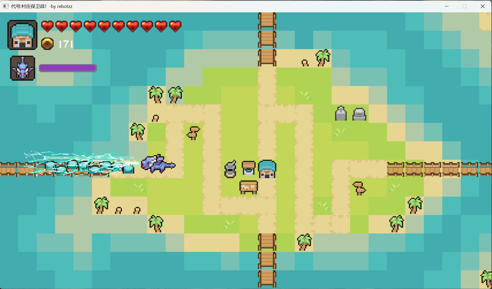

# 游戏《代号：村庄保卫战！》

## 塔防游戏：《代号：村庄保卫战！》
- 1.看完教程后就没有"抄代码"，一边画图一边code，算是借鉴了代码框架和思路。一些组件自己实现。
- 2.训练了Debug能力，找Bug真麻烦。尤其需要冷静，因为最后可能只是写错了几个字符。
- 3.对json/csv格式进行了读写。将对应数据转化为游戏数据，地图。
- 4.对UI组件/碰撞管理器/模板单例/观察者模式等多了一份理解。(eg:范围攻击的碰撞/索敌优先级)
- 5.三方库使用:SDL2/SDL_gfx/jsoncpp
- 6.感觉是一次特训，对于之前知识的综合训练。

## 总结

## Todo
- 1.或许可以改为多关卡模式，加入场景管理器，读取新的配置文件，将部分static去掉
- 2.世界地图的摄像机暂时还不能实现，待学习。

## Debug
- 1.jsoncpp因为使用vcpkg安装过了，所以没有注意到jsoncpp.cpp源文件需要一同编译，所以可执行总是有jsoncpp.dll
- 2.Debug技巧：Debug模式下，中断报错后，点击”重试“可以看函数栈帧等信息。

## 吐槽 
越到后面越难写，前面的小bug变得诡异难找。
虽然最后找到都是一些小问题，但是排查不到，或者不容易复现bug，
你就像迷失在大雾中，开始怀疑自己之前是否走错。

接下来应该会学习一些设计模式，没有这个真的不好处理。
然后，我想学学游戏引擎，一直都是没有引擎写（超级简陋的引擎基础功能），还不知道引擎的知识。

## 游戏截图展示

