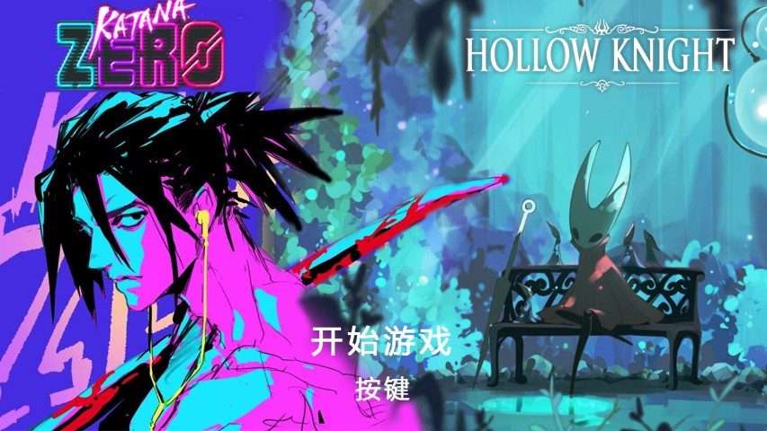
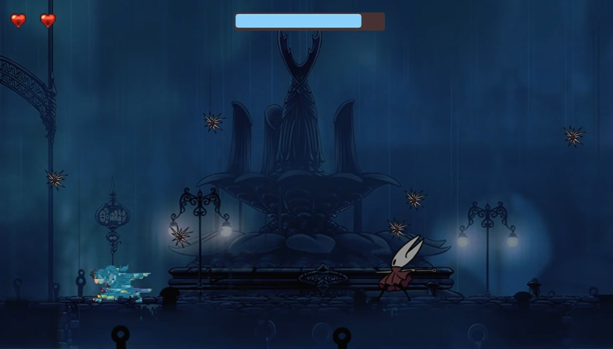

# 游戏: 空洞武士  (空洞骑士 + 武士零)

## 简单写写
- 1. 终于写完了,很容易写bug啊
- 2. 使用了管理器: 资源管理器, 碰撞管理器, 角色管理器, 场景管理器, 音乐播放管理器
- 3. 对单例模式, 工厂模式多了些理解
- 4. 一些很酷的功能: [武士零]子弹时间, 时间倒带效果,  [空洞骑士]下劈, 拼刀机制 
- 5. 粒子系统: 子弹时间残影特效, 流血特效, 拼刀火花特效, 闪电特效等, 甚至还可以实现对话文本
- 6. 发现定义和实现分离的好处，可以在cpp文件中包含.h文件，不想包含的东西
- 7. 加入了传送门和测试木头人

小发现: 这两个游戏,一个攻击向前位移,一个攻击碰撞向后位移

## 吐槽
- 1. 写的越多就感觉框架很重要,后面函数调用一层调一层,不好找bug,或许我该画图捋捋思路
- 2. 抠图,找音效,找素材也很耗时间
- 3. 关于时间的能力, 2077的V的义体,时空幻境的主角,武士零,我的阴暗面的小女孩......时间能力啊,或许还有一些别的玩法可以开发

## 游戏截图

