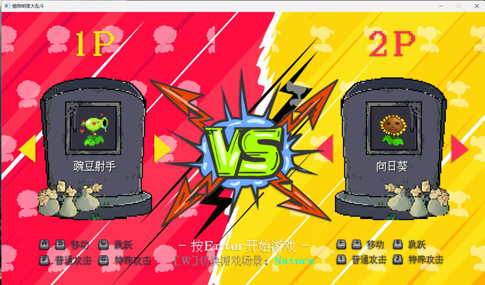
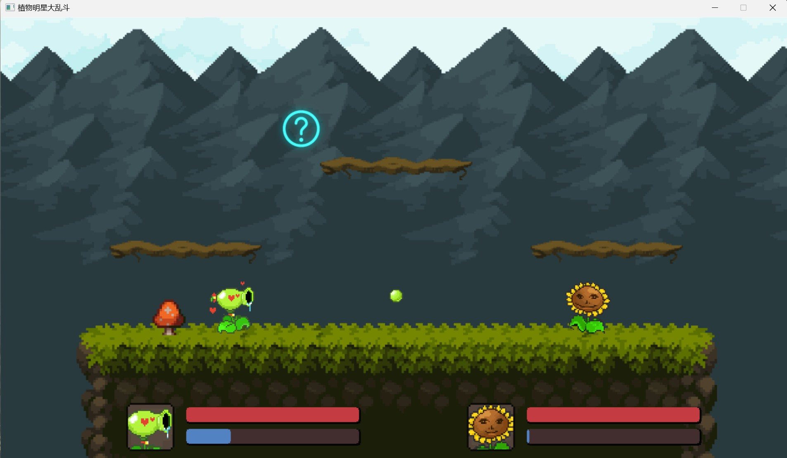
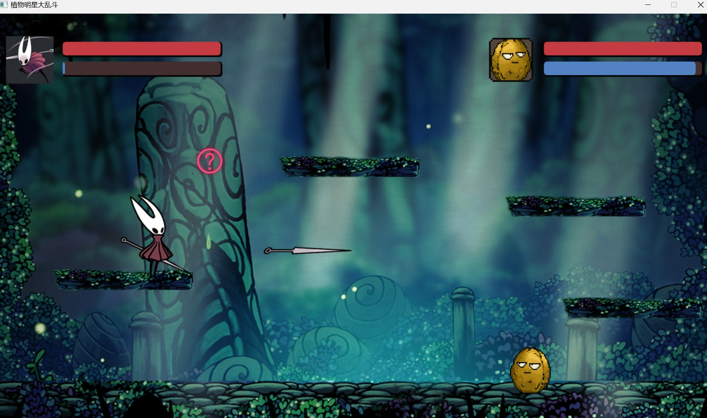

# 植物明星大乱斗

- 1.数据逻辑和渲染分离
- 2.场景管理器, 定时器, 摄像机, 动画类,状态机
- 3.物理逻辑
- 4.粒子系统

- 其他
```
各种子弹
场地buff
新增角色: 空洞骑士 大黄蜂
新增游戏场景: 空洞骑士

```

## todo
- 1.人机对战 暂时算了,知识不足
- 2.随着代码和资源数量增加,代码管理难度越来越大, 急需新的知识: 资源管理器, 碰撞管理器


## 游戏截图


